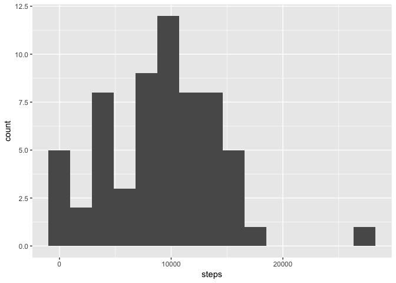
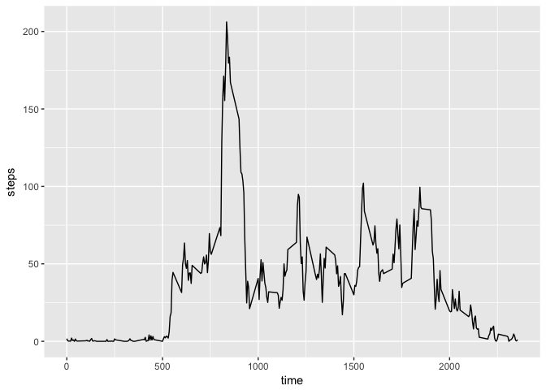
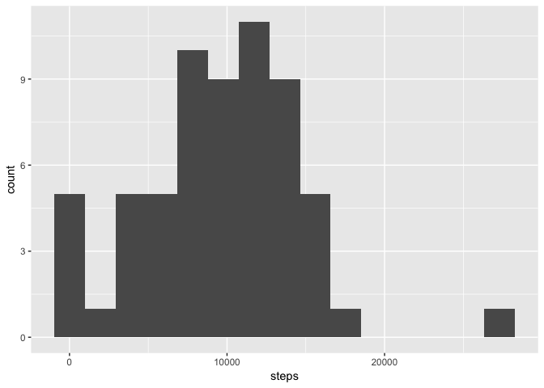
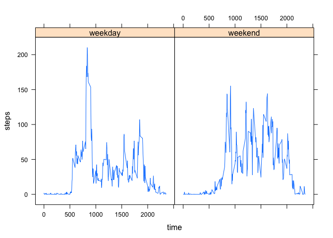

Submission - Vincent Chan
================

Summary
-------

This project involves the analysis of personal activity monitoring device data. Data about the number of steps taken is recorded at 5-minute intervals for two months (Oct-Nov 2012) from an anonymous individual. The original data is included in this repository and was forked from rdpeng's parent repository.

Initializing
------------

In order to complete this project, I had to load ggplot2 and lattice.

``` r
library(ggplot2)
```

    ## Warning: package 'ggplot2' was built under R version 3.3.2

``` r
library(lattice)
```

Reading in and processing data
------------------------------

First steps taken to prepare the data were reading the .csv contained within the .zip file and transforming dates and intervals into POSIXct. While I forced dates and times out of POSIXct later on, it's the most straightforward way to store time data for these observations.

``` r
## read the data
activity <- read.csv((unz("activity.zip","activity.csv")))

## transform dates and intervals into POSIXct and store
activity$tstamp <- as.POSIXct(paste(as.character(activity$date),
                              sprintf("%04d",activity$interval)), format="%Y-%m-%d %H%M")
```

Overview plot and summary
-------------------------

I performed a general overview of the data by plotting a histogram of the number of steps per day, removing any NA observations. I also calculated the mean and median values of steps per day. NB: removing NA observations gives at best an accurate view of the step activity on a given day but probably reduces the activity values from what the subject actually did.

``` r
## calculate total steps per day, ignoring NAs
stepperday <- aggregate(activity$steps, by=list(as.Date(activity$tstamp)), FUN=sum,
                        na.rm=TRUE)
names(stepperday) <- c("date","steps")

## plot a histogram of the steps per day in 15 bins
qplot(steps,data=stepperday,bins=15)
```



``` r
## calculate mean and median steps per day
meandaystep <- mean(stepperday$steps)
mediandaystep <- median(stepperday$steps)
```

**The mean number of steps each day is 9203.3548387, and the median number of steps per day is 9572.**

Activity profile of an average day
----------------------------------

In order to get an idea of the variation in activity throughout an average day, I calculated the mean for any given time of day across the two-month period. A graph of this reveals a profile that matches what one would expect of a person not doing shift work. (I.e., activity is highest during daylight hours and lowest in the nighttime hours.)

``` r
## calculate mean steps per time of day, ignoring NAs
stepbytime <- aggregate(activity$steps, 
                        by=list(as.integer(strftime(activity$tstamp, format="%H%M"))),
                        FUN=mean, na.rm=TRUE)
names(stepbytime) <- c("time","steps")

## graph the mean steps per time of day
qplot(time,steps,data=stepbytime,geom="line")
```



``` r
## determine the five-minute interval with the highest mean steps
mostactivetime <- sprintf("%04d", stepbytime$time[stepbytime$steps==max(stepbytime$steps)])
```

**We see that the most active time of day for this user is typically 0835.**

Imputing missing data
---------------------

By performing a quick analysis, we see that there are a fairly large number of missing observations.

``` r
## calculate the number of NAs recorded
missindex <- which(is.na(activity$steps))
numNAs <- length(missindex)
```

**The data is missing 2304 observations.**

We can try to improve the accuracy of our representation of the subject's daily activity by filling in some of these values. A low estimate of this missing data might be to compare a day's total number of steps to the mean number of daily steps. This gives us a factor for the day's activity, and we can use this as a multiplier to the average activity for each interval to estimate whether the subject was more or less active at a given time than average, and how many steps were missed.

``` r
## create a new dataframe for activity with NAs replaced (fixed)
## NAs are replaced using [mean steps for that time interval] * [total steps for that day]
##                        / [mean steps per day]
## if total steps for a day is NA, then 0 is used
## this results in a low estimate of the number of steps that should be in that interval

fixact <- activity
fillact <- data.frame(date=as.Date(activity$tstamp[missindex]),time=as.integer(strftime(activity$tstamp[missindex], format="%H%M")))
for (i in 1:length(missindex)){
  fillact$timestep[i] <- stepbytime$steps[stepbytime$time==fillact$time[i]]
  fillact$daystep[i] <- stepperday$steps[stepperday$date==fillact$date[i]]
  if(is.na(fillact$daystep[i])){
    fillact$daystep[i] <- 0
  }
}
fillact$steps <- fillact$timestep * fillact$daystep / meandaystep
fixact$steps[missindex] <- as.integer(fillact$steps)
```

There is a trap here: if a day is full of NA values, the formula breaks down to an NA multiplier. To avoid this problem, I replaced a day full of NAs with 0 activity. We'll just assume that it was a day with no activity, (e.g., a day in bed with the flu watching football or Netflix, being waited on with chicken soup).

New overview with imputed values
--------------------------------

After imputing these values we can create a new histogram for comparison.

``` r
## repeat first steps (histogram, basic analysis) with imputed values
fixstepperday <- aggregate(fixact$steps, by=list(as.Date(fixact$tstamp)), FUN=sum,
                        na.rm=TRUE)
names(fixstepperday) <- c("date","steps")

## plot a histogram of the steps per day in 15 bins
qplot(steps,data=fixstepperday,bins=15)
```



``` r
## calculate mean and median steps per day
fixmeandaystep <- mean(fixstepperday$steps)
fixmediandaystep <- median(fixstepperday$steps)
```

**We find that the new mean steps per day is 9629.6129032 compared with the 9203.3548387 from the raw data. The new median is 9960.5 versus 9572. The step counts increase, naturally, since we're adding steps that were omitted as a result of the NA values.**

Comparing weekday and weekend activity
--------------------------------------

By separating days into weekend and weekday categories, we can see if there is considerable difference in behavior depending on what the subject does on the weekday. We would expect msot people to be markedly more sedentary on weekdays than weekends, and that appears to be true for our subject, as well. NB: we used the imputed data here, as well.

``` r
## add weekday/weekend factors
fixact$busday <- weekdays(fixact$tstamp)
fixact$busday[fixact$busday == "Sunday"| fixact$busday == "Saturday"] <- "weekend"
fixact$busday[!fixact$busday == "weekend"] <- "weekday"
fixact$busday <- as.factor(fixact$busday)
  
## make a lattice plot of weekdays vs weekends
fixact$time <- as.integer(strftime(fixact$tstamp, format="%H%M"))
fixstepbytime <- aggregate(steps ~ time + busday, fixact, mean)
xyplot(steps ~ time | busday, data=fixstepbytime, type="l")
```


